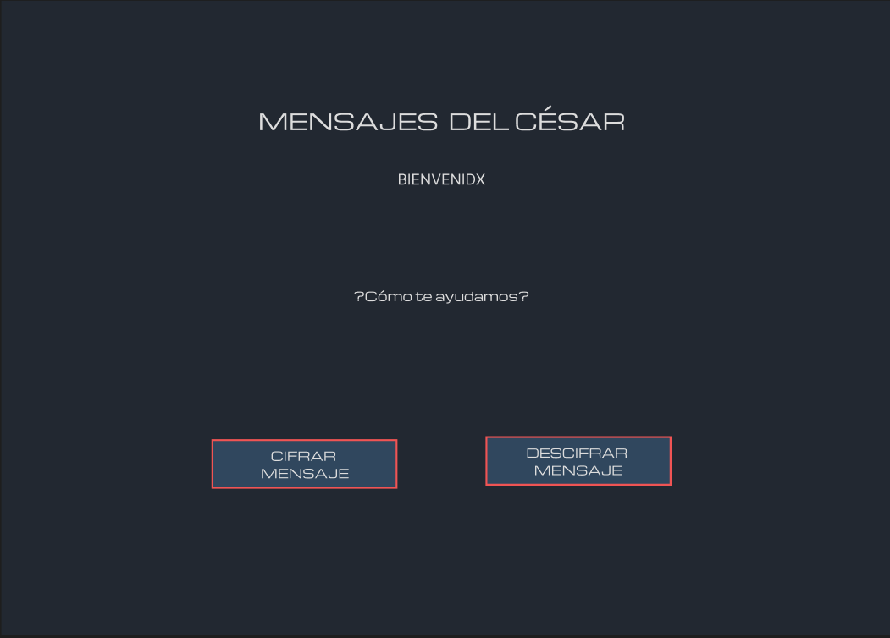
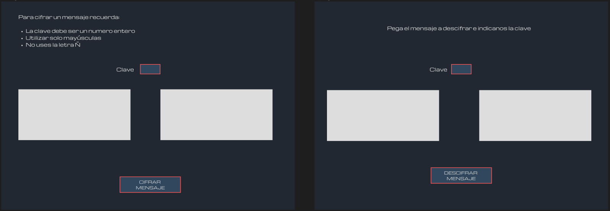
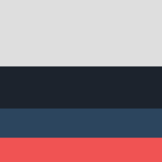
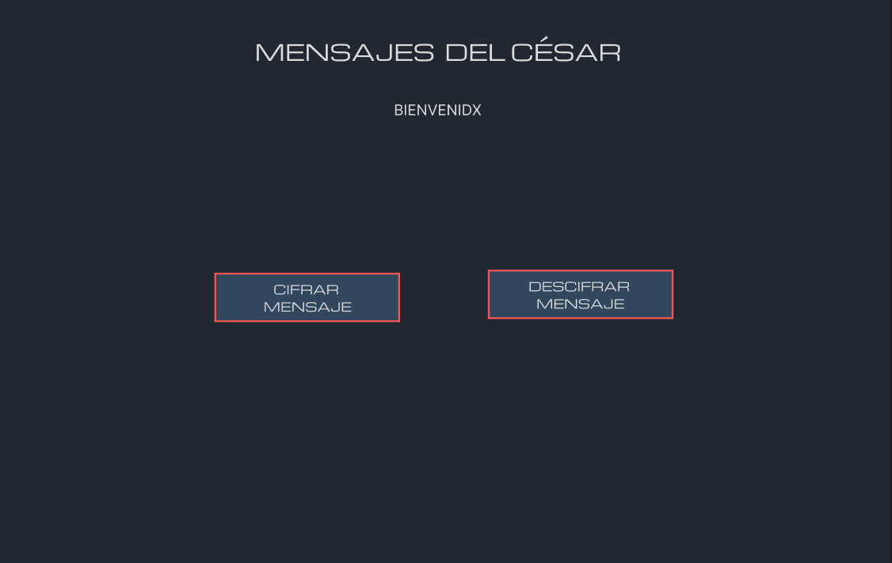
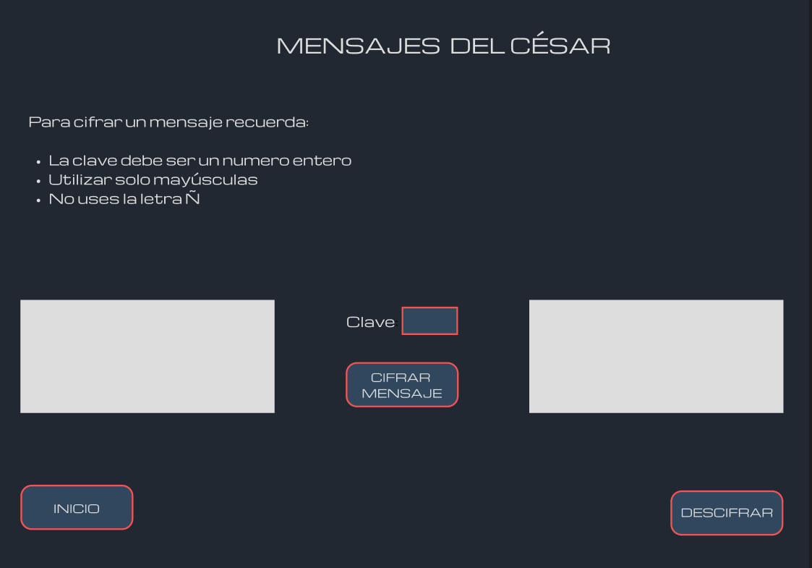
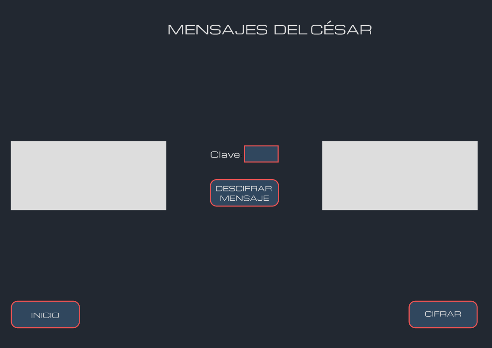
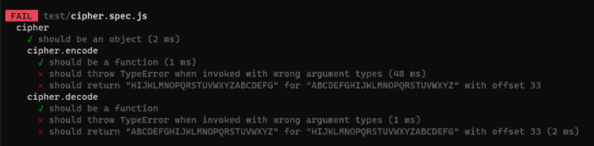
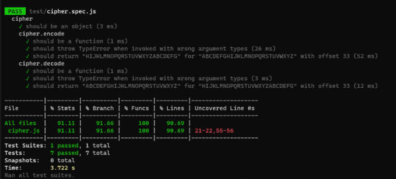

# <font color ="red">CIFRADO CESAR </font>
---
## Proyecto 1

### Laboratoria 💛 DEV002 Desarrollo Web
* *Berenice Hernández*

 ---
 ---

El desarrollo de este proyecto se realizó por etapas, las cuales indico a continuación.

* [0. Primeros pasos](#0-primeros-pasos)
* [1. Diseño](#1-diseño)
* [2. Maquetación](#2-maquetacion)
* [3. Estilos](#3-estilos)
* [4. Funciones en Java Script](#4-funciones-en-java-script)
* [5. Pruebas](#5-pruebas)
* [6. Rediseño](#6-rediseño)
* [7. Ajuste de código](#7-ajuste-de-codigo)
* [8. Deploy en Github Pages](#8-deply-en-github-pages)
* [9. Creación de métodos y objetos](#9-creacion-de-metodos-y-objetos)
* [10. Pruebas unitarias](#10-pruebas-unitarias)

***

## 0. Primeros pasos
En este proyecto se utilizó Visual Studio Code, Windows Subsystem for Linux (WSL), Node.js, Git y GitHub.

## 1. Diseño
EL diseño está pensado como una aplicación sencilla de cifrado. 

### Prototipo
Para la creación del prototipo se usó [Figma](https://www.figma.com/file/3P8Bnb6Z48Ouvehx6y2fx6/Untitled?node-id=0%3A1).

De principio se opto por un diseño de 3 pantallas independientes, es decir cada una con un HTML y JS diferentes.

La pantalla principal con un mensaje de bienvenida y 2 botones que llevarian a las otras dos pantallas:


Las pantallas "secundarias", dependiendo de si se trataba de cifrado o descifrado, contienen un texto con algunas instrucciones, 2 cajas de texto, un input y un boton. En la caja de texto de la izquierda se ingresa el texto a cifrar y/o descifrar y en la de la derecha aparece el resultado que se espera, texto cifrado o descifrado, segun sea el caso. 



EL input, al que se le etiquetó como "Clave", solo acepta numeros enteros positivos.

El botón es quien se encargará de llamar a la funcion correspondiente para que tome el texto de la izquierda, lo procese y muestre en la caja de la derecha el resultado.

### Colores
Se eligió una paleta con colores neutros, cuidando el contraste en el uso de los mismos pensando en accesibilidad.


- #DDDDDD
- #222831
- #30475E
- #F05454

### Fuente
La fuente usada se llama [Michroma](https://fonts.google.com/specimen/Michroma?preview.text=MENSAJES%20DEL%20C%C3%89SAR&preview.text_type=custom) obtenida Google Fonts.

## 2. Maquetación
Utilizando HTML semántico, comencé por maquetar las 3 ventanas en archivos distintos, ya que se había pensado en ese flujo, cada pantalla en una ventana nueva. Cada boton de la pantalla principal abria una nueva ventana con la pantalla segun el caso, cifrar o descifrar mensaje.

## 3. Estilos
Los estilos siempre se manejaron en un solo archivo.
- Se resetearon los estilos por default. 
- Se utlizaron selectores de etiqueta y de clase.
- Se usaron pseudoclases

En esta primera entrega no se tiene un proyecto responsivo. Esta pensado para desktop unicamente.

## 4. Funciones en Java Script
Una vez que se tuvo lista la maquetación de cada pantalla y los estilos se aplicaron, comencé con el análisis del problema y fui resolviendo paso a paso cada necesidad hasta llegar a las funciones de cifrado y descifrado. Es importante mencionar que así como se crearon distintos archivos html por pantalla, así fue tambien con javascript, uno por cada pantalla.

### Análisis del problema
1. El valor del input "Clave" solo debe aceptar numeros positivos.
2. EL boton debe traer a JavaScript el valor ingresado en el input
3. El texto ingresado en la caja de texto debe guardarse en un arreglo.
4. Crear una función para convertir el valor de cada letra del texto ingresado, en ASCII
5. Guardar en un arreglo el valor del ASCII obtenido
6. Aplicar la fórmula de cifrado a cada valor del arreglo ASCII.
7. Guardar en un arreglo el ASCII cifrado.
8. Convertir cada valor del ASCII cifrado a letras del alfabeto.
9. Imprimir el texto cifrado en la caja de texto correspondiente.
10. Se agrega la validación para que respete los espacios cuando se ingrese una frase.
11. Crear la función para descifrado ajustando la formula y tomando de referencia la lógica de la función de cifrado.
12. Hacer el push hacia repositorio remoto
13. Deploy en GitHub Pages
14. Refactorización de código en cada función, cifrado y descifrado

## 5. Pruebas
Probe la funcionalidad y la experiencia de usar la aplicacion en ventanas separadas, la conslusion fue que no era nada agradable, ademas de que una vez abierto una de las ventanas secundarias no había forma de regresar al inicio desde ahí. Tomé la decisión de rediseñar las ventanas y por consecuencia ajustar el código. 

## 6. Rediseño
En primer lugar hice los cabiós en Figma, agregue botones y reacomodé los elementos:

**Pantalla principal**



**Pantalla Cifrado**

En medio de las cajas de texto se quedó el input de la clave y el botón para cifrar, abajo en cada extremo agregué dos botones, uno para regresar al inicio y otro para pasar a la ventana de descifrado.


**Pantalla Descifrado**

De igual forma se reacomodó en esta ventana, con la diferiencia que en la esquina inferior derecha, el botón cambia para ir a la ventana de cifrado.



## 7. Ajuste de código

### HTML

Dada la decisión de rediseño, todos los archivos html se unieron en una sola estructura, index.html, cada pantalla se dividio en secciones(section), quedando dentro de main lo siguiente:

```
    <main >
      <section id="main-section" class="index-main">
      </section>
      <section id="encode-section" class="encode">
      </section>
      <section id="decode-section" class="decode">
      </section>
    </main>
```

De esta forma, al darle click a cada botón, se ocultaban las secciones que no se utilizaban. Por ejemplo, desde la pantalla principal, al hacer click en CIFRAR MENSAJE, la main-section y decode-section se ocultaban y se mostraba solo la encode-section. Se crearon las funciones correspondientes para estas acciones, ejemplo:

```
function showEncodeSection() {
    document.getElementById("main-section").style.display = "none";
    document.getElementById("encode-section").style.display = "flex";
    document.getElementById("decode-section").style.display = "none";
}
```

### JavaScript
Al igual que con HTML, las funciones se pasaron al index.js, se ajustaron las variables e incluso se pudo reducir un poco mas las líneas de código. Hasta este momento, tanto escuhar los elementos del DOM como funciones se ejecutaban desde un solo archivo. 

## 8. Deploy en GitHub Pages
Para hacer el deploy se realizó la configuración correspondiente, se cambió el nombre al repositorio remoto y al local también. Una vez lista la configuración, se hizo push, se corrigieron algunos errores y se dejó lista la aplicación en el sitio.

Cabe mencionar que ya antes había realizado un procedimiento similar por lo que no fue un proceso en el que no me llevé mucho tiempo.

## 9. Creación de métodos y objetos
Un paso que dejé para el final, lo cual no fue la mejor decisión, fue crear el objeto y sus métodos.

El boilerplate ya tenía lista las lineas de exportación e importación.

En el archivo **cipher.js** cree el objeto llamado cipher con sus 2 métodos, encode y decode. Pase a cada método, el código de cada función creada al inicio. Se tuvieron que modificar algunas variables. 

### Método encode

```
encode: function (offset, text) {
        if(text === undefined || offset === undefined) {
            throw new TypeError("Escribe el texto")
        } else if (text === typeof 0 || offset === 0) {
            throw new TypeError ("Valor invalido")
        }

        let textInASCII = [];
        let codeTextInASCII = [];
        let codeText = [];

        if (offset % 26 === 0) {
            throw new TypeError("Por seguridad ingresa un numero distinto")
        } else {
            for (let i=0; i < text.length; i++) {
                let x = text.charCodeAt(i);
                textInASCII.push(x)
                if (textInASCII[i] === 32) {
                    let l = 32;
                    codeTextInASCII.push(l);
                } else {
                    let l = ((textInASCII[i] - 65 + offset) % 26) + 65;
                    codeTextInASCII.push(l);
                }
                let y = String.fromCharCode(codeTextInASCII[i]);
                codeText.push(y);
            }
        }
        console.log(codeText.join(''));
        return codeText.join('');
```
Finalmente dejé en **index.js** las variables para escuchar al DOM y desde ahi se invocó al objeto con su respectivo método según era necesario:

```
botonCifrarS.addEventListener("click", function(){
    if (text.value === '') {
        alert("Agrega texto a cifrar")
    } else if (inputC.value === '') {
        alert("Especifica clave de cifrado")
    }

    let valor = parseInt(inputC.value);
    let otext = text.value;

    ctext.innerHTML = cipher.encode(valor, otext);
})
```

## 10. Pruebas unitarias
Las pruebas unitarias fue un proceso completamente nuevo para mi, aunque ya tenía terminada la aplicación y en la UI se obtenia el resultado esperado, las pruebas seguían fallando. 

Con ayuda de la coach Luna, aprendí a leer cada test para corregir los errores:
- Agregar Type error con condicionales
- LLamar a los métodos con parámetros y en el orden indicado (offset, text)

```
        if(text === undefined || offset === undefined) {
            throw new TypeError("Escribe un texto valido")
        } else if (text === typeof 0 || offset === 0) {
            throw new TypeError ("Ingresa un valor válido")
        }
```
```
ctext.innerHTML = cipher.encode(valor, otext);
```
Finalmente se completó el proyecto, en esta primera versión, pasando pruebas unitarias y con el despliegue en GitHub Pages



[Cifrado César creado por Bere](https://beresdev.github.io/DEV002-cipher/)


